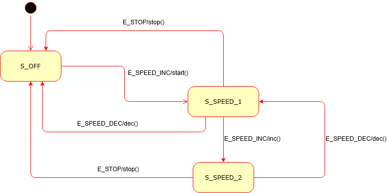

# s_automata_cpp: C++ template based automata class


s_automata_cpp is a C++ template class that ease development of state/transition automatas.

## Usage

The template arguments are TState, TEvent, and TActions:

- TState: Type for automata states
- TEvent: Type for automata events
- TActions: Class for automata actions. These are class methods with signature void method_name(void). Actions are executed when firing a transition.

```cpp
template <typename TState, typename TEvent, typename TActions>
class Automata
{
    // Automata code
};
```

The public methods are detailled below:

```cpp
template <typename TState, typename TEvent, typename TActions>
class Automata
{
public:
    // Set initial state of automata
    bool init(const TState &initialState);

    // Handle event and fire corresponding transition. Action is executed before changing state.
    bool handleEvent(const TEvent &event, TActions &actions);

    // Add a transition to automata
    void addTransition(const TState &from, const TState &to, const TEvent &evt, void (TActions::*action)(void));

    // Get the current state of automata
    const TState &getCurrentState() const;
};
```

## Example of use

See example files.

### How to compile them

```bash
g++ example1.cpp -o ex1
g++ example2.cpp -o ex2
```

Example 2 automata is depicted below.



Usage and initilisation of Example 2 automata is the following one.

```cpp
    Motor motor;
    Automata<States, Event, Motor> motor_automata;

    motor_automata.addTransition(S_OFF, S_SPEED_1, E_SPEED_INC, &Motor::start);
    motor_automata.addTransition(S_SPEED_1, S_SPEED_2, E_SPEED_INC, &Motor::inc);
    motor_automata.addTransition(S_SPEED_2, S_SPEED_1, E_SPEED_DEC, &Motor::dec);
    motor_automata.addTransition(S_SPEED_1, S_OFF, E_STOP, &Motor::stop);
    motor_automata.addTransition(S_SPEED_2, S_OFF, E_STOP, &Motor::stop);
    motor_automata.addTransition(S_SPEED_1, S_OFF, E_SPEED_DEC, &Motor::dec);

    motor_automata.init(S_OFF);

    std::cout << "Motor state is " << motor_automata.getCurrentState() << std::endl;
    std::cout << "Motor speed is " << motor.getSpeed() << std::endl;

    motor_automata.handleEvent(E_SPEED_INC, motor);
```

## Some history on this old code

This code was developed in 2004 and was part of an ambitious (and immodest) side project named __Sofia__. It intended to be a way for developing knowledge.

Its immodest introduction motto was (in french):

_Dans la seconde moitié du Ve siècle avant JC, les sophistes firent profession d'enseigner la sofia, c'est à dire tout ce qui rend l'homme plus habile, plus savant, plus vertueux. Philosophes, ils étudiaient la logique, les phénomènes célestes, remettant en question les idées reçues, éveillant les intelligences._

Which is translated in:

_In the second half of the 5th century BC, sophists made a profession of teaching sofia, that is, all that  makes man more skilful, more learned, more virtuous. Philosophers, they studied logic, celestial phenomena, questioning conventional wisdom, awakening intelligences._

Unconsciously and unrelatedly, Sofia is also the name of my beloved daughter, born in 2015.

## Contact

If you want to contact me you can reach me at <ludorg@ludorg.net>.

## License

This project uses the following license: [MIT](https://github.com/Ludorg/s_automata_cpp/blob/master/LICENSE).
